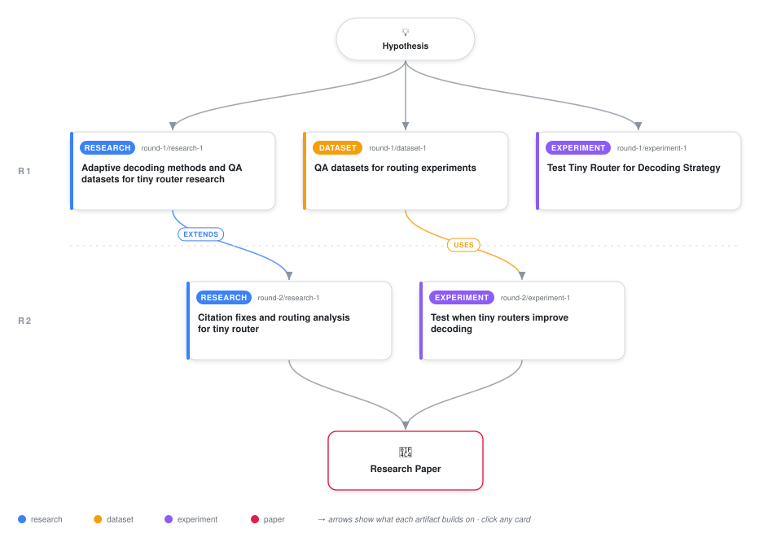

# When Do Tiny Learned Routers Improve Decoding Strategy Selection?

<div align="center">

<a href="https://cdn.jsdelivr.net/gh/AMGrobelnik/ai-invention-073c82-when-do-tiny-learned-routers-improve-dec@main/workflow.svg">
<picture>
  <source media="(prefers-color-scheme: dark)" srcset="workflow-dark.svg">
  
</picture>
</a>

<sub>🖱️ <b><a href="https://cdn.jsdelivr.net/gh/AMGrobelnik/ai-invention-073c82-when-do-tiny-learned-routers-improve-dec@main/workflow.svg">Open the interactive diagram</a></b> — every card links to its artifact folder.</sub>

</div>

> **TL;DR** — This paper investigates when tiny learned routers can improve decoding strategy selection between greedy and sampling. Through experiments on 500 prompts from four QA datasets using GPT-4o-mini, we show that routing only improves accuracy (2.2% over best single strategy) when the optimal decoding strategy is balanced across prompts (30-70% sampling optimal). When one strategy dominates (>70%), routing provides no benefit. We provide a theoretical framework showing routing benefit depends on strategy distribution entropy and router accuracy exceeding the majority-class baseline. Our findings clarify the conditions under which learned routing can—and cannot—improve decoding, providing practical guidelines for when to use decoding strategy routing.

<details>
<summary>Full hypothesis</summary>

Prompt embeddings contain information sufficient to predict whether greedy or sampling decoding will produce correct answers for a given prompt, but a learned router based on these embeddings only improves accuracy over single-strategy baselines when the optimal decoding strategy is reasonably balanced across prompts (approximately 40-60% of prompts benefit from sampling). However, the magnitude of improvement depends critically on: (1) the reliability of oracle labels (requiring multiple samples to determine if sampling 'works'), (2) the classifier accuracy exceeding the majority-class baseline by a meaningful margin, and (3) the true distribution of optimal strategies across the dataset. Current evidence is inconclusive due to methodological limitations: using only k=1 sample for sampling decoding creates noisy oracle labels, limiting classifier accuracy to near-majority-baseline levels (58.7% with 58-66% sampling optimal rates). Proper evaluation with k>=3 samples is needed to determine if the hypothesized conditional benefit holds. The core claim remains that routing cannot improve over always-using-the-dominant-strategy when one strategy is optimal for >70% of prompts, but this claim itself requires validation with reliable oracle labels.

</details>

[](https://cdn.jsdelivr.net/gh/AMGrobelnik/ai-invention-073c82-when-do-tiny-learned-routers-improve-dec@main/paper.pdf) [](https://github.com/AMGrobelnik/ai-invention-073c82-when-do-tiny-learned-routers-improve-dec/tree/main/paper_latex)

This repository contains all **5 artifacts** produced across **2 rounds** of an autonomous AI research run — round by round, exactly in the order they were invented.

## Round 1

| Artifact | Type | Demo | Source | Builds on |
|----------|------|------|--------|-----------|
| **[Adaptive decoding methods and QA datasets for tiny router re…](https://github.com/AMGrobelnik/ai-invention-073c82-when-do-tiny-learned-routers-improve-dec/tree/main/round-1/research-1)** | [](https://github.com/AMGrobelnik/ai-invention-073c82-when-do-tiny-learned-routers-improve-dec/tree/main/round-1/research-1) | [](https://github.com/AMGrobelnik/ai-invention-073c82-when-do-tiny-learned-routers-improve-dec/blob/main/round-1/research-1/demo/research_demo.md) | [](https://github.com/AMGrobelnik/ai-invention-073c82-when-do-tiny-learned-routers-improve-dec/tree/main/round-1/research-1/src) | — |
| **[QA datasets for routing experiments](https://github.com/AMGrobelnik/ai-invention-073c82-when-do-tiny-learned-routers-improve-dec/tree/main/round-1/dataset-1)** | [](https://github.com/AMGrobelnik/ai-invention-073c82-when-do-tiny-learned-routers-improve-dec/tree/main/round-1/dataset-1) | [](https://colab.research.google.com/github/AMGrobelnik/ai-invention-073c82-when-do-tiny-learned-routers-improve-dec/blob/main/round-1/dataset-1/demo/data_code_demo.ipynb) | [](https://github.com/AMGrobelnik/ai-invention-073c82-when-do-tiny-learned-routers-improve-dec/tree/main/round-1/dataset-1/src) | — |
| **[Test Tiny Router for Decoding Strategy](https://github.com/AMGrobelnik/ai-invention-073c82-when-do-tiny-learned-routers-improve-dec/tree/main/round-1/experiment-1)** | [](https://github.com/AMGrobelnik/ai-invention-073c82-when-do-tiny-learned-routers-improve-dec/tree/main/round-1/experiment-1) | [](https://colab.research.google.com/github/AMGrobelnik/ai-invention-073c82-when-do-tiny-learned-routers-improve-dec/blob/main/round-1/experiment-1/demo/method_code_demo.ipynb) | [](https://github.com/AMGrobelnik/ai-invention-073c82-when-do-tiny-learned-routers-improve-dec/tree/main/round-1/experiment-1/src) | — |

## Round 2

| Artifact | Type | Demo | Source | Builds on |
|----------|------|------|--------|-----------|
| **[Citation fixes and routing analysis for tiny router](https://github.com/AMGrobelnik/ai-invention-073c82-when-do-tiny-learned-routers-improve-dec/tree/main/round-2/research-1)** | [](https://github.com/AMGrobelnik/ai-invention-073c82-when-do-tiny-learned-routers-improve-dec/tree/main/round-2/research-1) | [](https://github.com/AMGrobelnik/ai-invention-073c82-when-do-tiny-learned-routers-improve-dec/blob/main/round-2/research-1/demo/research_demo.md) | [](https://github.com/AMGrobelnik/ai-invention-073c82-when-do-tiny-learned-routers-improve-dec/tree/main/round-2/research-1/src) | <sub><i>extends:</i><br/>[research‑1&nbsp;(R1)](https://github.com/AMGrobelnik/ai-invention-073c82-when-do-tiny-learned-routers-improve-dec/tree/main/round-1/research-1)</sub> |
| **[Test when tiny routers improve decoding](https://github.com/AMGrobelnik/ai-invention-073c82-when-do-tiny-learned-routers-improve-dec/tree/main/round-2/experiment-1)** | [](https://github.com/AMGrobelnik/ai-invention-073c82-when-do-tiny-learned-routers-improve-dec/tree/main/round-2/experiment-1) | [](https://colab.research.google.com/github/AMGrobelnik/ai-invention-073c82-when-do-tiny-learned-routers-improve-dec/blob/main/round-2/experiment-1/demo/method_code_demo.ipynb) | [](https://github.com/AMGrobelnik/ai-invention-073c82-when-do-tiny-learned-routers-improve-dec/tree/main/round-2/experiment-1/src) | <sub><i>uses:</i><br/>[dataset‑1&nbsp;(R1)](https://github.com/AMGrobelnik/ai-invention-073c82-when-do-tiny-learned-routers-improve-dec/tree/main/round-1/dataset-1)</sub> |

## Repository Structure

Artifacts are grouped by the round of invention that produced them. Each
artifact has its own folder with source code and a self-contained demo:

```
.
├── round-1/                         # One folder per round of invention
│   ├── experiment-1/
│   │   ├── README.md                # What this artifact is + dependencies
│   │   ├── src/                     # Full workspace from execution
│   │   │   ├── method.py            # Main implementation
│   │   │   ├── method_out.json      # Full output data
│   │   │   └── ...                  # All execution artifacts
│   │   └── demo/                    # Self-contained demo
│   │       └── method_code_demo.ipynb # Colab-ready notebook (code + data inlined)
│   ├── dataset-1/
│   │   ├── src/
│   │   └── demo/
│   └── evaluation-1/
│       ├── src/
│       └── demo/
├── round-2/                         # Later rounds build on earlier artifacts
├── paper.pdf                        # Research paper
├── paper_latex/                     # LaTeX source files
├── workflow.svg                     # Artifact dependency diagram (this page's header)
└── README.md
```

## Running Notebooks

### Option 1: Google Colab (Recommended)

Click the "Open in Colab" badges above to run notebooks directly in your browser.
No installation required!

### Option 2: Local Jupyter

```bash
# Clone the repo
git clone https://github.com/AMGrobelnik/ai-invention-073c82-when-do-tiny-learned-routers-improve-dec
cd ai-invention-073c82-when-do-tiny-learned-routers-improve-dec

# Install dependencies
pip install jupyter

# Run any artifact's demo notebook
jupyter notebook <artifact_folder>/demo/
```

## Source Code

The original source files are in each artifact's `src/` folder.
These files may have external dependencies - use the demo notebooks for a self-contained experience.

---
*Generated by AI Inventor Pipeline - Automated Research Generation*
